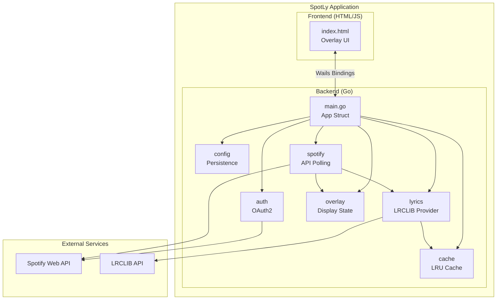

# Architecture Overview

High-level architecture of the SpotLy lyrics overlay application.

---

## System Diagram

---

## Component Responsibilities

| Component | Responsibility |
|-----------|----------------|
| **main.go** | Application entry, Wails lifecycle, service coordination |
| **auth** | Spotify OAuth2 flow, token management |
| **config** | JSON configuration persistence |
| **cache** | In-memory LRU lyrics cache |
| **lyrics** | Fetch and parse lyrics from LRCLIB |
| **overlay** | Manage display state and calculate current line |
| **spotify** | Poll Spotify API, detect track changes |
| **Frontend** | Render overlay UI, handle user interactions |

---

## Technology Stack

| Layer | Technology |
|-------|------------|
| Language | Go 1.24 |
| Framework | Wails v2.11 |
| Frontend | Vanilla HTML/CSS/JS |
| Spotify Client | `github.com/zmb3/spotify/v2` |
| OAuth | `golang.org/x/oauth2` |
| Windows API | `golang.org/x/sys/windows` |

---

## External APIs

### Spotify Web API

| Endpoint | Purpose |
|----------|---------|
| `/me/player/currently-playing` | Get current track and playback state |

**Rate Limits:** Fair use (no hard limit published, but ~1 req/sec is safe)

### LRCLIB API

| Endpoint | Purpose |
|----------|---------|
| `/api/get` | Exact match by artist + track |
| `/api/search` | Fuzzy search |
| `/api/get/{id}` | Fetch by ID |

**Rate Limits:** No authentication required, no published limits

---

## Data Storage

| Data | Location |
|------|----------|
| Configuration | `~/.spotly/config.json` |
| OAuth Tokens | Stored in config.json |
| Lyrics Cache | In-memory only (not persisted) |

---

## See Also

- [Data Flow](DATA_FLOW.md) - How data moves through the system
- [Backend Overview](backend/README.md) - Package details
- [Wails Integration](wails/README.md) - Framework setup
