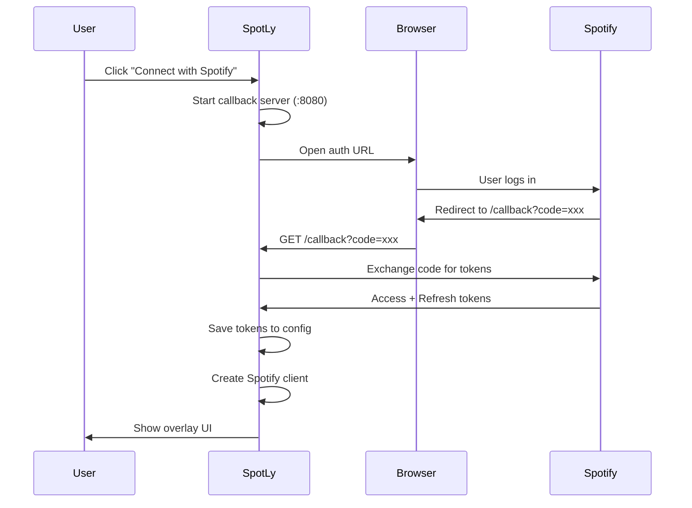
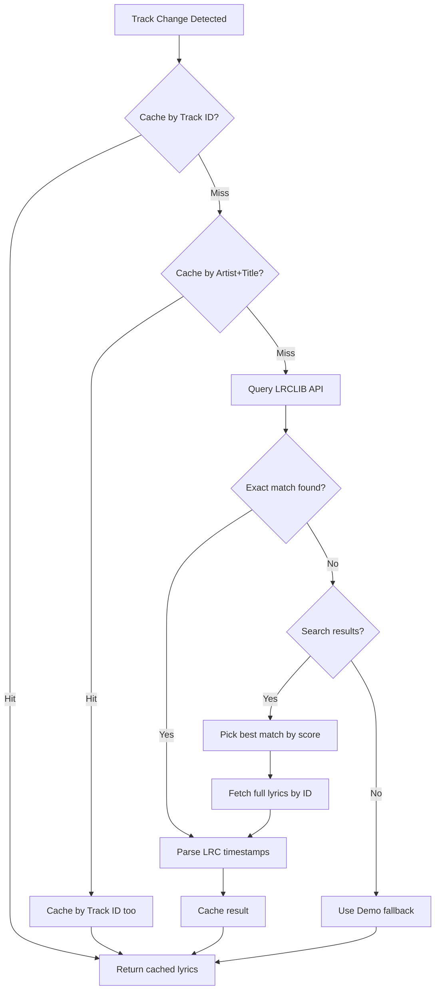
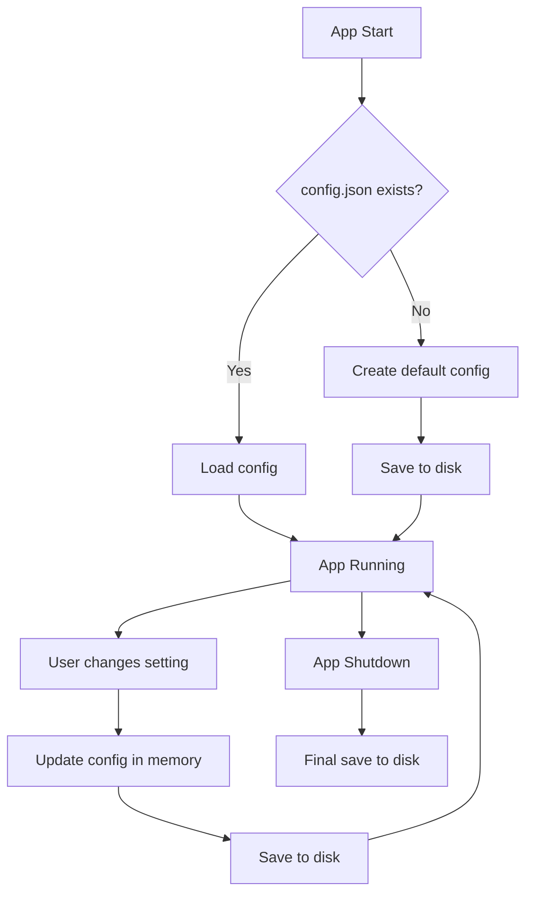
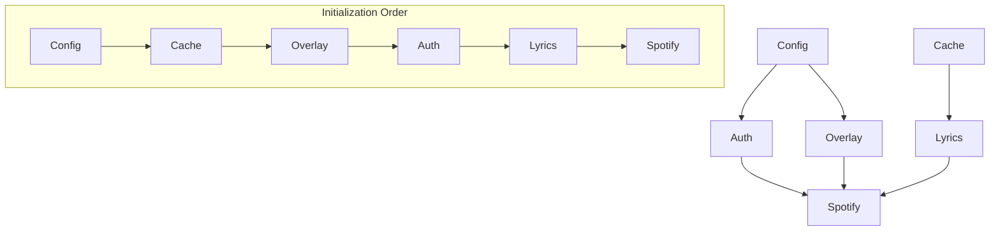

# Data Flow

How data moves through the SpotLy application.

---

## Authentication Flow



---

## Lyrics Fetching Pipeline



---

## Real-Time Display Update

```mermaid
flowchart LR
    subgraph "Backend (5s interval)"
        A[Spotify Poll] --> B[Update TrackInfo]
        B --> C[Progress + Timestamp]
    end
    
    subgraph "Frontend (50ms interval)"
        D[GetDisplayInfo()] --> E[Calculate current progress]
        E --> F[Find matching lyrics line]
        F --> G[Update UI]
    end
    
    C --> D
```

### Progress Calculation

```
effective_progress = stored_progress 
                   + time_since_last_poll 
                   + sync_offset
```

This allows smooth karaoke animation without waiting for API polls.

---

## Configuration Persistence



---

## Service Dependencies



---

## Frontend ↔ Backend Communication

| Direction | Mechanism | Example |
|-----------|-----------|---------|
| Frontend → Backend | Wails bindings | `window.go.main.App.GetDisplayInfo()` |
| Backend → Frontend | Return values | `DisplayInfo` struct as JSON |
| Direct UI control | Wails runtime | `window.runtime.WindowSetPosition()` |

---

## See Also

- [Architecture](ARCHITECTURE.md) - System overview
- [Backend Overview](backend/README.md) - Package details
- [API Reference](API_REFERENCE.md) - External API details
